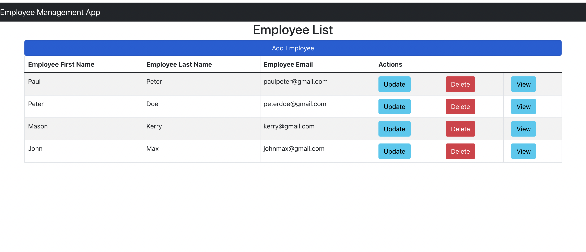
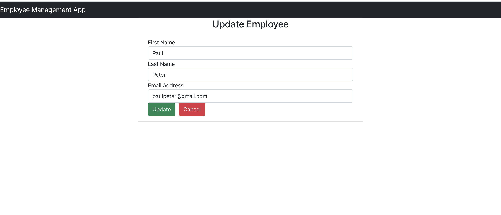

# employeeapp-react-frontend
A simple react app to connect with a backend service to aid the reaction, deletion and other operations on employee. The backend app is written using Scala and http4s

## Available Scripts 

In the project directory, you can run:
- `npm install or npm i` to install the needed dependencies and then
- `npm start` to start the application

Runs the app in the development mode.\
Open [http://localhost:3000](http://localhost:3000) to view it in your browser.

### Sample app
This is how the complete app looks like when connected with the backend. Users can add employees, delete, edit and read.

### Sample update page

